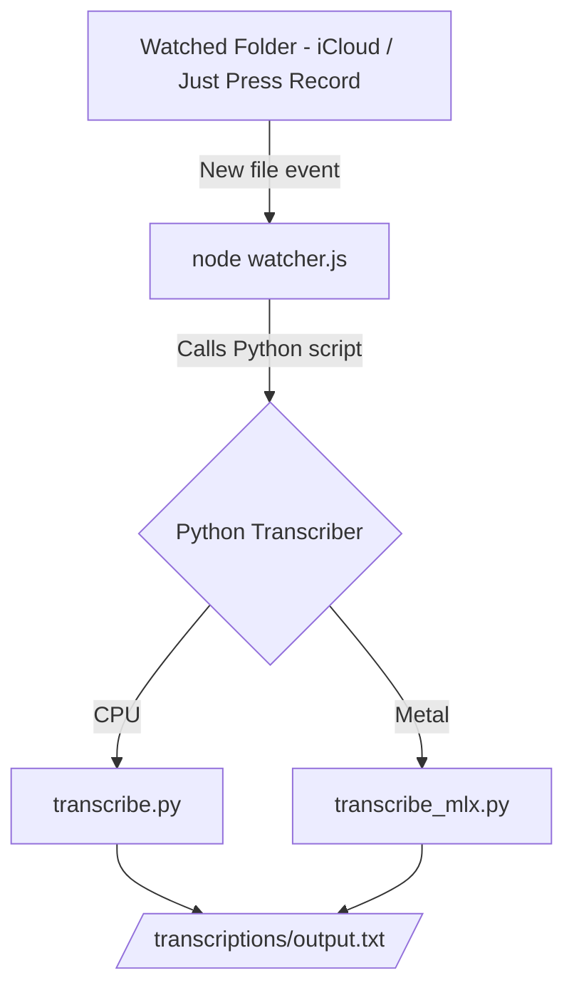

# AutoTranscribe

Automatic transcription pipeline for local macOS using **Python**, **MLX Whisper (Apple Silicon)**, and a **Node-based file watcher**.

This project lets you:

- Drop an audio file in a folder
- Automatically transcribe it
- Save the text output locally
- Run fully offline
- Use either **Fast CPU Whisper** or **Metal-accelerated MLX Whisper**

---

## 📁 Project Structure

```
AutoTranscribe/
│
├── models/                     # Whisper models cache
├── temp/                       # Temporary working files
├── test/                       # Integration tests for the Node watcher
├── venv/                       # Python virtual environment (not checked in)
├── src/
│   ├── python/
│   │   ├── transcribe.py        # Faster-Whisper (CPU) version
│   │   └── transcribe_mlx.py    # MLX Whisper (Metal) version
│   │
│   └── node/
│       ├── config.js            # Centralized paths + binaries
│       ├── ensureDirectories.js # Creates required folders
│       ├── ingestJustPressRecord.js # iCloud JPR ingestion + flatten
│       ├── jobTranscribe.js     # Single-file transcription/rename
│       ├── queue.js             # Simple async queue
│       ├── startAll.js          # Launches ingester + watcher
│       ├── transcriber.js       # Node → Python MLX Whisper bridge
│       ├── watcher.js           # Watches /recordings for new files
│       ├── package.json
│       └── package-lock.json
│
├── .gitignore
└── README.md

```

---

## 🔧 1. Python Environment Setup

### Install Python 3.11 (if missing)

```
brew install python@3.11

```

### Create a dedicated venv

```
cd ~/Code/AutoTranscribe
python3.11 -m venv venv
source venv/bin/activate

```

### Install required packages

**CPU Whisper (faster-whisper):**

```
pip install --upgrade pip
pip install faster-whisper

```

**MLX Whisper (Apple Silicon accelerated):**

```
pip install mlx-whisper

```

---

## 🎤 2. Using Faster-Whisper (Python CPU)

File: `src/python/transcribe.py`

Usage:

```
source venv/bin/activate
python3.11 src/python/transcribe.py /path/to/audio.m4a

```

Output:

- Detects language
- Prints transcription
- Runs fully offline (after models downloaded)

---

## ⚡️ 3. Using MLX Whisper (Metal / Apple Silicon)

File: `src/python/transcribe_mlx.py`

Usage:

```
source venv/bin/activate
python3.11 src/python/transcribe_mlx.py /path/to/audio.m4a

```

Notes:

- First run downloads \~1.5 GB MLX model
- Much faster on M1/M2/M3 Macs
- Perfect for daily automatic transcription

---

## 👁 4. Node Watcher (Auto-transcribe on new files)

Install Node dependencies:

```
cd src/node
npm install

```

Run watcher:

```
node watcher.js

```

What it does:

- Watches the `/recordings` folder
- When a new file arrives:
  - triggers Python transcription
  - saves `.txt` output
  - renames the audio with `_transcribed` so it is not reprocessed

Start both ingest (Just Press Record) and watcher together:

```
cd ~/Code/AutoTranscribe/src/node
npm run start:local
```

This runs the Just Press Record ingester and the transcription watcher side by side. Leave the terminal open while it runs. If you only need the ingester, run `npm run ingest:jpr`. Paths live in `src/node/config.js`.

Replace Shortcuts ingestion with the built-in sync watcher:

```
cd ~/Code/AutoTranscribe/src/node
node ingestJPR.js
```

This monitors Just Press Record in iCloud (`~/Library/Mobile Documents/iCloud~com~openplanetsoftware~just-press-record/Documents`), flattens dated folders into `YYYY-MM-DD_HH-MM-SS.m4a`, copies them into `/recordings`, and removes the source file/folder. Paths live in `src/node/config.js`.

### Autostart on login (macOS)

Use a launchd job so the ingester + watcher run after login without a terminal:

```
# Create the launch agent (one-time)
cat <<'PLIST' > ~/Library/LaunchAgents/com.autotranscribe.startlocal.plist
<?xml version="1.0" encoding="UTF-8"?>
<!DOCTYPE plist PUBLIC "-//Apple//DTD PLIST 1.0//EN" "http://www.apple.com/DTDs/PropertyList-1.0.dtd">
<plist version="1.0">
<dict>
  <key>Label</key>
  <string>com.autotranscribe.startlocal</string>
  <key>ProgramArguments</key>
  <array>
    <string>/bin/zsh</string>
    <string>-lc</string>
    <string>cd /Users/joostokkinga/Code/AutoTranscribe/src/node && npm run start:local</string>
  </array>
  <key>WorkingDirectory</key>
  <string>/Users/joostokkinga/Code/AutoTranscribe/src/node</string>
  <key>EnvironmentVariables</key>
  <dict>
    <key>PATH</key>
    <string>/opt/homebrew/bin:/usr/local/bin:/usr/bin:/bin:/usr/sbin:/sbin</string>
  </dict>
  <key>RunAtLoad</key>
  <true/>
  <key>KeepAlive</key>
  <true/>
  <key>StandardOutPath</key>
  <string>/tmp/autotranscribe.startlocal.out</string>
  <key>StandardErrorPath</key>
  <string>/tmp/autotranscribe.startlocal.err</string>
</dict>
</plist>
PLIST

# Load (or reload after edits)
launchctl unload -w ~/Library/LaunchAgents/com.autotranscribe.startlocal.plist 2>/dev/null
launchctl load -w ~/Library/LaunchAgents/com.autotranscribe.startlocal.plist

# Tail logs if needed
tail -f /tmp/autotranscribe.startlocal.out /tmp/autotranscribe.startlocal.err
```

To stop autostart for a session, unload the plist. To permanently remove it, delete the plist and unload it.

**Recommended single-agent setup**
- Keep only one launch agent to avoid duplicate watchers. Use the direct Node agent already installed at `~/Library/LaunchAgents/nl.joost.autotranscribe.start.plist`.
- Disable other autotranscribe launch agents (if present) and reload the main one:

```
launchctl unload -w ~/Library/LaunchAgents/com.autotranscribe.startlocal.plist 2>/dev/null
launchctl unload -w ~/Library/LaunchAgents/com.autotranscribe.sync.plist 2>/dev/null
launchctl unload -w ~/Library/LaunchAgents/nl.joost.autotranscribe.start.plist
launchctl load  -w ~/Library/LaunchAgents/nl.joost.autotranscribe.start.plist
```

Logs for this agent: `~/Library/Logs/autotranscribe.out.log` and `~/Library/Logs/autotranscribe.err.log`.

---

## 🧱 5. Architecture Overview


---

## 🧪 6. Quick Test

```
source venv/bin/activate
python3.11 src/python/transcribe_mlx.py test.m4a

```

If you see Dutch handled correctly → everything works.

---

## 📌 7. Recommended Ignore Rules (.gitignore)

```
venv/
models/
temp/
node_modules/
**/__pycache__/
.DS_Store
*.log
```
